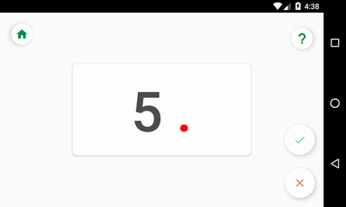
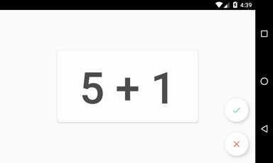
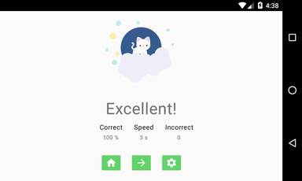

Simple Math Trainer
=================

This application is a tool for parents who teach their children to count.
( 1 through 100, addition)

Features:
clean design (include focus mode)
smooth increase in complexity
additional tasks

You can find the full version on google play.

Screenshots
-----------

Libraries Used
--------------
* [Foundation] - Components for core system capabilities, Kotlin extensions and support for
  multidex and automated testing.
  * [AppCompat] - Degrade gracefully on older versions of Android.
  * [Android KTX] - Write more concise, idiomatic Kotlin code.
* [Architecture]- A collection of libraries that help you design robust, testable, and
  maintainable apps. Start with classes for managing your UI component lifecycle and handling data
  persistence.
  * [Lifecycles] - Create a UI that automatically responds to lifecycle events.
  * [LiveData] - Build data objects that notify views when the underlying database changes.
  * [Room] - Access your app's SQLite database with in-app objects and compile-time checks.
  * [ViewModel] - Store UI-related data that isn't destroyed on app rotations. Easily schedule
     asynchronous tasks for optimal execution.
  * [WorkManager] - Manage your Android background jobs.
* Third party
  * [CardStackView] for cards

License
-------

Copyright 2020 Ovcharenko Ekaterina, Inc.

Licensed to the Apache Software Foundation (ASF) under one or more contributor
license agreements.  See the NOTICE file distributed with this work for
additional information regarding copyright ownership.  The ASF licenses this
file to you under the Apache License, Version 2.0 (the "License"); you may not
use this file except in compliance with the License.  You may obtain a copy of
the License at

  http://www.apache.org/licenses/LICENSE-2.0

Unless required by applicable law or agreed to in writing, software
distributed under the License is distributed on an "AS IS" BASIS, WITHOUT
WARRANTIES OR CONDITIONS OF ANY KIND, either express or implied.  See the
License for the specific language governing permissions and limitations under
the License.
